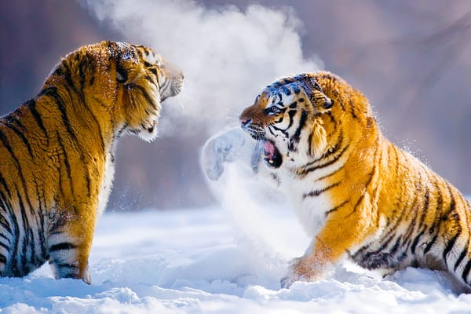
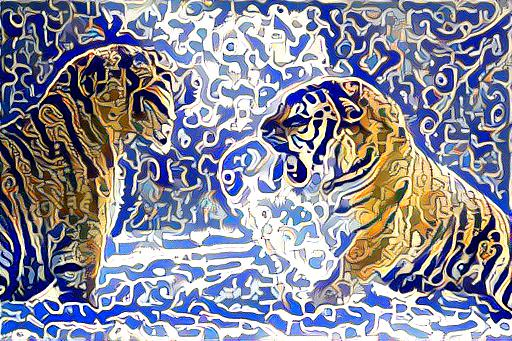
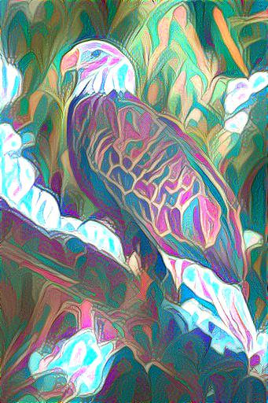
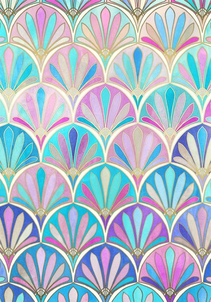

# Machine Learning Crash Course | Bornhack 2019
## Introduction
This repository contains the code, slides and references for a 45 minute presentation delivered at the Bornhack 2019 conference. 

This readme is meant as a **one-stop shop for finding your way into the world of Machine Learning / Artificial Intelligence**. 

You may be entirely new to the worlds of data science, data engineering and software development. That's ok, you're in the right place. This document's job is to direct you to the right resources such as:

* MOOC courses
* techniques, algorithms & libraries
* tools, books, articles 

and even organizations, events and groups of like-minded people within the world of ML that may be of interest to you, depending on which branch of ML / AI caught your eye.

We'll also showcase the code and core concepts for **neural style transfer** in a separate jupyter notebook, the end results will look like this (and you'll be able to **run it on your own images** to play around with it!):

Original Image           |  Restyled Image          | Style Sample
:-------------------------:|:-------------------------:|:-------------------------:
 |    | 
 |    | 

## Table of Contents

- [Introduction](#introduction)
- [Setup](#setup)
- [Resources](#resources)
  - [Natural Language Processing](#natural-language-processing)
  - [Neural Style Transfer](#neural-style-transfer)
  - [ML Youtube Channels](#ml-youtube-channels)
- [Next Steps](#next-steps)
- [Acknowledgements](#acknowledgements)
- [Contribute](#contribute)
- [License](#license)

## Setup
You can either simply read about the resources in the next section and follow any that pique your interest or you can install the requirements from the requirements.txt file present in this repository and follow along the code part of this presentation in a **jupyter notebook** or **jupyter lab**.

I recommend doing that in a separate virtual environment, created by installing the `virtualenv` module first:

    pip install virtualenv

Followed by the creation of your own virutal environment for this repository:

    python3 -m venv /path/to/your/virtual/environment

You can then activate this virtual environment on Mac and Linux (recommended) via:

    source <venv>/bin/activate

And on Windows through:

    <venv>\Scripts\activate

You can also accomplish the same clarity of dependencies with e.g. conda, if you prefer.

Finally, to install the exact versions of the required libraries:

    pip install -r requirements.txt
    conda install --file requirements.txt 

You will need python version 3.7.0, as indicated by the badge on top of this readme file. You can check your python version through:

    python --version

The last thing you'll need are **the weights for the vgg network**, which can be downloaded from [here](https://bethgelab.org/media/uploads/pytorch_models/vgg_conv.pth), and then need to be placed in the `data/vgg_weights` directory.

You're all set!

## Resources
Here, you can find resources grouped by branches of ML.

### Natural Language Processing
* Natural Language Processing
    * NLP Preprocessing - my own [article on medium](https://medium.com/@mateusz.jurewicz/machine-learning-natural-language-preprocessing-with-python-5922d79d9ee2)

### Neural Style Transfer

* Neural Style Transfer
    * General introduction by Jeremy Howard's Fastai, [youtube lecture 13](https://www.youtube.com/watch?v=xXXiC4YRGrQ)
    * Introductory articles by Vamshik Shetty and Pawan Sasanka Ammanamanchi, [part 1 on medium](https://towardsdatascience.com/neural-style-transfer-tutorial-part-1-f5cd3315fa7f)
    * Transferring style in 3D, [article](https://dcgi.fel.cvut.cz/home/sykorad/styleblit.html) by Daniel Sýkora, Ondřej Jamriška et al., short [youtube introduction](https://www.youtube.com/watch?v=S7HlxaMmWAU) by Two Minute Papers

### ML Youtube Channels
* **Youtube Channels** about ML, Deep Learning, Artificial intelligence:
    * Wonderful channel by [Rob Miles](https://www.youtube.com/channel/UCLB7AzTwc6VFZrBsO2ucBMg), with a strong focus on long-term artificial general intelligence, but also explaining recent papers within the field of ML in some depth.
    * Bite-sized introductions to recent ML (& much more) papers by [Two Minute Papers](https://www.youtube.com/user/keeroyz)
    * Great, foundational channel devoted to the Fastai course by [Jeremy Howard](https://www.youtube.com/user/howardjeremyp/playlists)
    * [Siraj Raval](https://www.youtube.com/channel/UCWN3xxRkmTPmbKwht9FuE5A/videos)'s channel about libraries in ML, new papers and even the business side of working as an ML engineer. Personally a bit too flashy for my taste, but perhaps it will be just the thing for you :)
    * Honorable mention: [Tom Scott](https://www.youtube.com/watch?v=-JlxuQ7tPgQ)'s video about a specific AGI scenario
    * For more youtube outlets, check out [this list](https://blog.feedspot.com/machine_learning_youtube_channels/)

## Next Steps

Jump into the references from above, share your experiences with the wider ML / AI community, make things that work and have fun :).

## Acknowledgements

The presentation's core is the neural style transfer code, heavily borrowed from Pawan Sasanka Ammanamanchi's (Shashi456@github) repository implementing the paper *"A Neural Algorithm of Artistic Style"* by Leon A. Gatys, Alexander S. Ecker and Matthias Bethge, available on arxiv [here](https://arxiv.org/abs/1508.06576). Pawan's implementation can be found [here](https://github.com/Shashi456/Neural-Style/tree/master/Neural%20Style%20Transfer) and his 6 part tutorial on neural style transfer, co-authored with Vamshik Shetty can be found [here](https://towardsdatascience.com/neural-style-transfer-series-part-2-91baad306b24). The original paper, the re-implementations and the articles are all fantastic.

## Contribute
Contributions are always welcome! 

If you find an error, a better reference point for the branch of ML, an updated version of a linked tool or such - please reach out via email at the address given in my github bio or propose a fix by opening a pull request.

## License

To the extent possible under law, the author has waived all copyright and related or neighboring rights to this work.