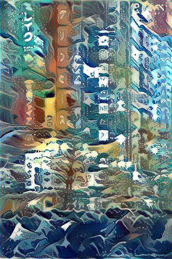

# Machine Learning Crash Course | Bornhack 2019
## Introduction
This repository contains the code, slides and references for a 45 minute presentation delivered at the Bornhack 2019 conference. 

This readme is meant as a **one-stop shop for finding your way into the world of Machine Learning & Artificial Intelligence**. 

You may be entirely new to the worlds of data science, data engineering and software development. That's ok, you're in the right place. This document's job is to direct you to the right resources such as:

* MOOC courses
* techniques, algorithms & libraries
* tools, books, articles 

and even organizations, events and groups of like-minded people within the world of ML that may be of interest to you, depending on which branch of ML / AI caught your eye.

We'll also showcase the code and core concepts for **neural style transfer** in a separate jupyter notebook, the end results will look like this (and you'll be able to **run it on your own images** to play around with it!):

Original Image           |  Restyled Image          | Style Sample
:-------------------------:|:-------------------------:|:-------------------------:
 |    | 
 |    | 
 |    | 

## Table of Contents

- [Introduction](#introduction)
- [Setup](#setup)
- [Resources](#resources)
  - [Core Concepts](#core-concepts)
  - [Advanced Concepts](#advanced-concepts)
  - [Libraries](#libraries)
  - [Visualizing ML](#visualizing-ml)
  - [Generative ML](#generative-ml)
  - [Federated ML](#federated-ml)
  - [Reinforcement Learning](#reinforcement-learning)
  - [Natural Language Processing](#natural-language-processing)
  - [Neural Style Transfer](#neural-style-transfer)
  - [Artificial General Intelligence](#artificial-general-intelligence)
  - [ML Youtube Channels](#ml-youtube-channels)
  - [ML Blogs and Articles](#ml-blogs-and-articles)
  - [Scientific Papers](#scientific-papers)
  - [Courses](#courses)
  - [Other](#other)
- [Next Steps](#next-steps)
- [Acknowledgements](#acknowledgements)
- [Contribute](#contribute)
- [License](#license)

## Setup
You can either simply read about the resources in the next section and follow any that pique your interest or you can install the requirements from the requirements.txt file present in this repository and follow along the code part of this presentation in a **jupyter notebook** or **jupyter lab**.

I recommend doing that in a separate virtual environment, created by installing the `virtualenv` module first:

    pip install virtualenv

Followed by the creation of your own virutal environment for this repository:

    python3 -m venv /path/to/your/virtual/environment

You can then activate this virtual environment on Mac and Linux (recommended) via:

    source <venv>/bin/activate

And on Windows through:

    <venv>\Scripts\activate

You can also accomplish the same clarity of dependencies with e.g. conda, if you prefer.

Finally, to install the exact versions of the required libraries:

    pip install -r requirements.txt
    conda install --file requirements.txt 

You will need python version 3.7.0, as indicated by the badge on top of this readme file. You can check your python version through:

    python --version

The last thing you'll need are **the weights for the vgg network**, which can be downloaded from [here](https://bethgelab.org/media/uploads/pytorch_models/vgg_conv.pth), and then need to be placed in the `data/vgg_weights` directory.

You're all set!

## Resources
Here, you can find resources grouped by branches of ML.

### Core Concepts

 * **How do machines learn?** - a cutesy, introductory [youtube video by CGP Grey](https://www.youtube.com/watch?v=R9OHn5ZF4Uo), albeit more focusing on genetic algorithms.
 * **Matrix Multiplication** - a simple, step by step [introduction to matmul](https://www.youtube.com/watch?v=aKhhYguY0DQ) by the Khan Academy.
* **Convolution basics**, an [interactive demonstration](http://setosa.io/ev/image-kernels/) of how a convolutional layer transforms an image, by Victor Powell.
 * **Backpropagation**, i.e. what makes learning possible, very nicely explained visually [here](https://google-developers.appspot.com/machine-learning/crash-course/backprop-scroll/).
 * **Nonlinear Activation Functions** a good [overview](https://www.analyticsvidhya.com/blog/2017/10/fundamentals-deep-learning-activation-functions-when-to-use-them/) of what they are and why they are needed, by Dishashree Gupta.

### Advanced Concepts

* **Recurrent Neural Networks** a concise & elegant [explanation of RNNs](https://colah.github.io/posts/2015-08-Understanding-LSTMs/) (particularly focusing on LSTMs - *Long Short Term Memory* layers) by Chris Olah.
* **Transfer Learning** - an [article](https://towardsdatascience.com/transfer-learning-with-convolutional-neural-networks-in-pytorch-dd09190245ce) explaining transfer learning in convolutional neural networks in PyTorch by Will Koehrsen.

### Libraries

At some point, you'll want to jump in-depth into one of the popular ML libraries:

* **Keras** library is the high-level api of Tensorflow. It is perhaps the easiest library towards starting to train your models. Here's the [introduction and documentation](https://keras.io/) for it. Created by Francois Chollet.
* **PyTorch** is the main competing library of Tensorflow, favored in the latest version of the FastAi online course. Here's a [page with setup and docs](https://pytorch.org/get-started/locally/).
* **TensorFlow** is Google's library for machine learning & deep learning, currently in version 2.0 - here's its [official page](https://www.tensorflow.org/) with installation instructions and tutorials. 
* **Switching from TensorFlow to PyTorch** - an [article](https://towardsdatascience.com/moving-from-keras-to-pytorch-f0d4fff4ce79) on medium by Rahul Agarwal, that can give you a sense of the differences between the two libraries.
* **FastAi Library** - effectively a high-level api for PyTorch but also something significantly more than that. You can find the [docs and installation guide](https://docs.fast.ai/) here.
* **XGBoost** library, implementing the gradient boosting framework, which has been very popular with regards to Kaggle challenges, it's docs can be found [here](https://xgboost.readthedocs.io/en/latest/).

There are other libraries that you may find useful - such as `numpy`, `pandas`, and `sklearn`. If you're not using Python, you may be interested in languages such as R and Julia, and their relevant ML libraries.

### Visualizing ML
A key problem in ML is transparency of the models. Here are some tools and articles that will help you both understand and then explain your models.

* **Simple Network Training in the Browser** - can be done and played around with [here](https://playground.tensorflow.org), helpful in building initial intuitions about what's happening during learning, with a beautiful and elegant visualization.
* **Convolutional Layers**
    * Simple, interactive visualization in [3D](http://scs.ryerson.ca/~aharley/vis/conv/) and [2D](http://scs.ryerson.ca/~aharley/vis/conv/flat.html) of convolutional, pooling and dense layers. It also shows how 2 convolutional layers are connected.
    * Great [medium article](https://towardsdatascience.com/how-to-visualize-convolutional-features-in-40-lines-of-code-70b7d87b0030) by Fabio M. Graetz on how to visualize your convolutional layers.
    * Fantastic, in-depth but easy to follow along [article](https://distill.pub/2017/feature-visualization/) by Chris Colah.
* **Activation Atlas**
    * Gorgeous [feature visualization atlas](https://distill.pub/2019/activation-atlas/) for the entire InceptionV1 network, revealing how a network represents larger visual concepts, by Shan Carter, Zan Armstrong et. al.

### Generative ML
Models that can generate new samples, similar to the ones they were exposed to, such as images, video, text or music.

* **Music Generation** - a [MuseNet paper](https://openai.com/blog/musenet/) by OpenAi regarding the generation of short musical samples.

### Federated Learning
How to train models on the devices, due to privacy concerns.

* **Federated Learning Protocol** - an [article](https://blog.acolyer.org/2019/06/07/towards-federated-learning-at-scale/) explaining the concept and protocol by Adrian Colyer.

### Reinforcement Learning
Software agents that act in an environment to maximize a reward function.

* **Best Hands-On Introductory Tutorial** to RL by the OpenAi team, called [SpinningUp](http://spinningup.openai.com/en/latest/spinningup/rl_intro.html). Includes a detailed but approachable introduction to all the relevant concepts, solid instructions on environment setup and specific examples of how to get started and run actual RL algorithms locally.
* **Unity's Environment Tool** for training RL agents in a way that's easy to visualize, [here](https://unity3d.com/machine-learning).

### Natural Language Processing
Working with understanding & generating text, translation & language models.

* **NLP Preprocessing** - my own [article on medium](https://medium.com/@mateusz.jurewicz/machine-learning-natural-language-preprocessing-with-python-5922d79d9ee2).
* **OpenAi's Generative Language Model** - which can spin up stories about unicorns, [here](https://openai.com/blog/better-language-models/).

### Neural Style Transfer
The core of the provided jupyter notebook and python script. Uses a pretrained network for visual classification in a very interesting way.

* **Neural Style Transfer**
    * General introduction by Jeremy Howard's Fastai, [youtube lecture 13](https://www.youtube.com/watch?v=xXXiC4YRGrQ).
    * Introductory articles by Vamshik Shetty and Pawan Sasanka Ammanamanchi, [part 1 on medium](https://towardsdatascience.com/neural-style-transfer-tutorial-part-1-f5cd3315fa7f).
    * Transferring style in 3D, [article](https://dcgi.fel.cvut.cz/home/sykorad/styleblit.html) by Daniel Sýkora, Ondřej Jamriška et al., short [youtube introduction](https://www.youtube.com/watch?v=S7HlxaMmWAU) by Two Minute Papers.

### Artificial General Intelligence
Speculative thoughts about a model that can generalize to many tasks, on a level comparable to human intelligence. Treat these with a grain of salt and more as an exercise in stretching the mind.

* **Orthogonality Thesis** - an [article](https://www.lesswrong.com/posts/nvKZchuTW8zY6wvAj/general-purpose-intelligence-arguing-the-orthogonality) regarding the possibility of any level of intelligence coinciding with any set of goals, by LessWrong's Eliezer Yudkovsky. 
* **Nick Bostrom's Superintelligence** [book](https://books.google.dk/books/about/Superintelligence.html?id=7_H8AwAAQBAJ&redir_esc=y), attempting to approach the idea of many types of enhanced intelligent agents and their consequences.
* **AI Boxing Problem** - and a [game concept](http://yudkowsky.net/singularity/aibox) about how even an oracle AI could be difficult to contain, as long as it can communicate with a person.
* **Universal Paperclip Maker** - a conceptual browser clicker game with some interesting undertones, playable [here](http://www.decisionproblem.com/paperclips/index2.html).

### ML Youtube Channels

* **Youtube Channels** about ML, Deep Learning, Artificial intelligence:
    * Wonderful channel by [Rob Miles](https://www.youtube.com/channel/UCLB7AzTwc6VFZrBsO2ucBMg), with a strong focus on long-term artificial general intelligence, but also explaining recent papers within the field of ML in some depth.
    * Bite-sized introductions to recent ML (& much more) papers by [Two Minute Papers](https://www.youtube.com/user/keeroyz).
    * Great, foundational channel devoted to the Fastai course by [Jeremy Howard](https://www.youtube.com/user/howardjeremyp/playlists).
    * [Siraj Raval](https://www.youtube.com/channel/UCWN3xxRkmTPmbKwht9FuE5A/videos)'s channel about libraries in ML, new papers and even the business side of working as an ML engineer. Personally a bit too flashy for my taste, but perhaps it will be just the thing for you :).
    * Honorable mentions: [Tom Scott](https://www.youtube.com/watch?v=-JlxuQ7tPgQ)'s video about a specific AGI scenario, and [Primer's](https://www.youtube.com/channel/UCKzJFdi57J53Vr_BkTfN3uQ) channel dedicated to running simulations to explain complex concepts in clearer ways.
    * For more youtube outlets, check out [this list](https://blog.feedspot.com/machine_learning_youtube_channels/).

### ML Blogs and Articles

  * Fantastic, in-depth but easy to follow articles by Chris Colah on his [blog](https://colah.github.io/about.html).
  * **Distil** - a wonderful source for high-quality, well-visualized ML [articles](https://distill.pub/).
  * **Acolyer** - a blog with daily articles about ML, math, programming and [more](https://blog.acolyer.org/) by Adrian Colyer.

You can also find plenty of interesting articles on `medium` and `towardsdatascience`.

### Scientific Papers

Many interesting papers are published on `arxiv` before they are published in a journal or conference. I personally recommend reading articles explaining the gist of the paper first, then the abstract and summary of the article instead of jumping straight in. Below are some examples of interesting papers.

* **Attentional Generative Adversarial Networks** - here's a [paper](http://openaccess.thecvf.com/content_cvpr_2018/CameraReady/0842.pdf) on how to teach a model to generate images based on sentences describing its content.
* **Concrete Problems in AI Safety** - a great paper proposing a set of safety scenarios that should be passed by the AI agent, available [here](https://arxiv.org/pdf/1606.06565.pdf).

There are so many it's hard to pick the most interesting ones, primarily be aware of the existence of `arxiv` and at some point consider reading and reimplementing the papers. There are good tools for managing the scientific papers such as `zotero` and `mendeley`.

### Courses

These are the foundational (but still quite in-depth) courses that you can take online if you're considering a career in ML.

  * **Andrew Ng's Introductory Stanford ML Course** available on [Coursera](https://www.coursera.org/learn/machine-learning). It includes a strong introduction to linear algebra and classically used algorithms for regression and classification. There's an option to take the paid version of the course and receive a linkedin certification. This was once considered to be the obligatory starting point for a career in ML. Has a very bottom-to-top approach, starting with an in-depth understanding of the underlying mathematical concepts.
  * **Jeremy Howard's FastAi Course** - in my opinion the [absolute best course](https://www.fast.ai/) available for quickly getting to a point where you can do meaningful work in the field. Has the opposite approach to the previous course, prefering to learn concepts (still very much in depth) by doing, top-down. It requires a lot of work and the setup of the environment can be challenging, but the skills gained by recreating the notebooks from this course are priceless. Study groups following this course together have recently become popular and they're a great way to stay motivated. 
  * **Selection of Specialized Deep Learning Courses**, available [here](https://www.deeplearning.ai/), at least partially created by Andrew Ng.

### Other

* **European Commission's Guidelines on Ethical Ai**, that promotes trustworthiness, can be found [here](https://ec.europa.eu/digital-single-market/en/news/ethics-guidelines-trustworthy-ai).
* **Meetups** - you may want to look up the PyData, DataViz, Computer Vision and other groups of interest in your area. Having people to share your work with and learn from them is a great way to expand one's understanding. I also recommend finding study groups for doing the online courses outlined in the previous sections. 

## Next Steps

Jump into the references from above, share your experiences with the wider ML / AI community, make things that work and have fun :).

## Acknowledgements

The presentation's core is the neural style transfer code, heavily borrowed from Pawan Sasanka Ammanamanchi's (Shashi456@github) repository implementing the paper *"A Neural Algorithm of Artistic Style"* by Leon A. Gatys, Alexander S. Ecker and Matthias Bethge, available on arxiv [here](https://arxiv.org/abs/1508.06576). Pawan's implementation can be found [here](https://github.com/Shashi456/Neural-Style/tree/master/Neural%20Style%20Transfer) and his 6 part tutorial on neural style transfer, co-authored with Vamshik Shetty can be found [here](https://towardsdatascience.com/neural-style-transfer-series-part-2-91baad306b24). The original paper, the re-implementations and the articles are all fantastic.

## Contribute
Contributions are always welcome! 

If you find an error, a better reference point for the branch of ML, an updated version of a linked tool or such - please reach out via email at the address given in my github bio or propose a fix by opening a pull request.

## License

To the extent possible under law, the author has waived all copyright and related or neighboring rights to this work.